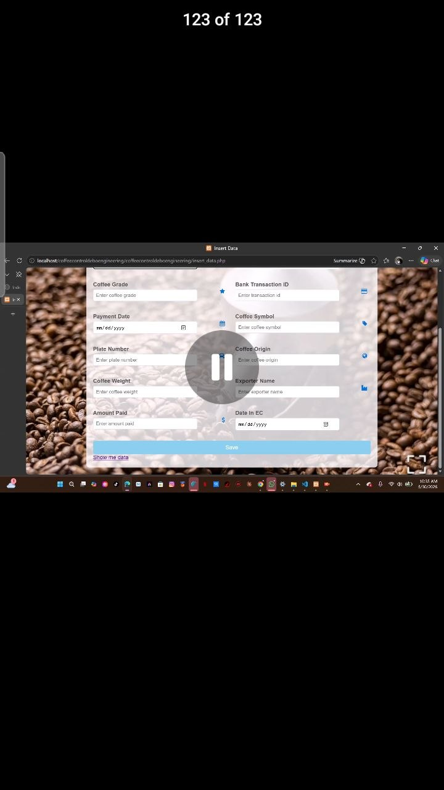
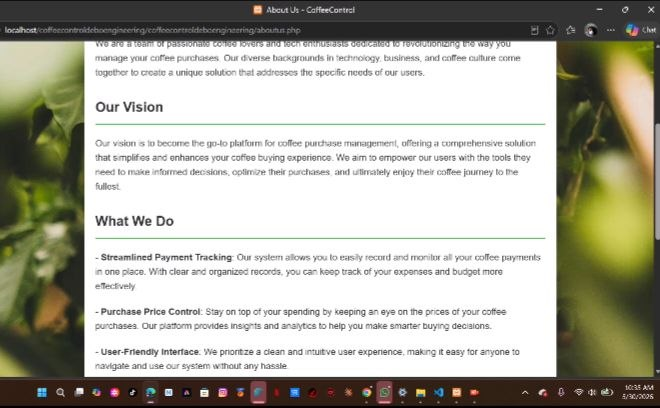
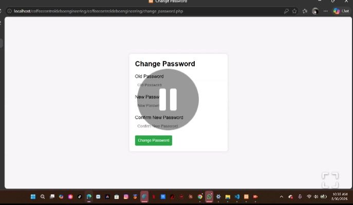
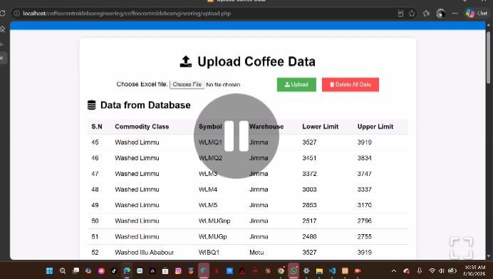

# Coffee Control Management System

## Overview

The Coffee Control Management System is a web-based application developed to support coffee data management, record keeping, calculations, reporting, and Excel-based data processing. The system enables users to efficiently handle coffee-related operational data through a user-friendly interface built with PHP and MySQL.

This project was developed by **Michael Yilkal** as a software engineering project focused on improving the accuracy and efficiency of coffee data handling and analysis.

## Key Features

* User authentication and account management
* Coffee production and operational data entry
* Data storage and retrieval using MySQL
* Automated calculations and reporting
* Average and statistical data processing
* Record updating and deletion
* Excel file upload and processing using PHPExcel
* Administrative functions for system management
* Web-based interface accessible through a browser

## Technologies Used

* PHP
* HTML5
* CSS3
* JavaScript
* MySQL
* Composer
* PHPExcel

## System Architecture

The application follows a traditional PHP web application architecture:

* Frontend: HTML, CSS, JavaScript
* Backend: PHP
* Database: MySQL
* Dependency Management: Composer
* Spreadsheet Processing: PHPExcel

## Installation

### Prerequisites

> Note: This project expects database credentials to be provided securely (for example via environment variables or a server-specific, non-committed config). Do not commit real secrets to Git.


* PHP 7.x or later
* MySQL Server
* Web Server (Apache, XAMPP, WAMP, or similar)
* Composer

### Setup Steps

1. Clone the repository:

   ```bash
   git clone <repository-url>
   ```

2. Place the project in your web server directory.

3. Create a MySQL database.

4. Configure database credentials in the project's configuration files:

   * `config.php`
   * `connect.php`
   * `db_connection.php`

5. Install dependencies if needed:

   ```bash
   composer install
   ```

6. Start the web server and access:

   ```
   http://localhost/project-folder
   ```

## Project Structure

* `index.php` – Application entry point
* `home.php` – Main dashboard
* `insert.php` – Data entry interface
* `display.php` – Data viewing and reporting
* `update.php` – Record update functionality
* `upload.php` – Excel file upload processing
* `config.php` – Configuration settings
* `vendor/` – Composer dependencies
* `PHPExcel-1.8/` – Excel processing library

## Screenshots






## Database


This project uses a local MySQL database server for storing and managing coffee-related operational data.

Database connection settings are configured through the project's PHP configuration files.

## Future Improvements

* Cloud database deployment
* Enhanced reporting and analytics
* Data visualization dashboards
* Role-based access control
* REST API integration
* Responsive mobile interface
* Automated backup and recovery features

## Author

**Michael Yilkal**

Software Developer

## Project Purpose

The purpose of this project is to improve coffee data handling, record management, calculation accuracy, and reporting efficiency through a web-based information system. It demonstrates practical software engineering skills including database design, backend development, file processing, and web application development.

